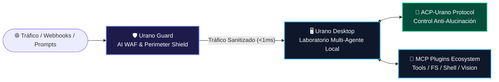

<div align="center">

# 🌌 Urano Tools

### *The Open-Source Autonomous AI Agents & Cyber Defense Ecosystem*

[](https://uranoai.com)
[](https://www.npmjs.com/package/@uranotools/urano-guard)
[](https://github.com/uranotools)
[](https://uranoproject.medium.com)
[](https://opensource.org/licenses/MIT)

<p align="center">
  <b>Construyendo el futuro de la Inteligencia Artificial Autónoma, Agentes Locales Soberanos y Ciberdefensa Perimetral de Alta Resiliencia.</b>
</p>

</div>

---

## ⚡ Nuestra Visión

**Urano Tools** es la división Open Source de **Urano Project**. Desarrollamos y liberamos herramientas de grado de ingeniería para desarrolladores, investigadores y empresas que construyen con **agentes de IA autónomos**.

Creemos firmemente que:
> *"La Inteligencia Artificial no debe ser un servicio cerrado que consumes. Debe ser una tecnología soberana que posees, controlas y proteges."*

---

## 🛡️ Arquitectura del Ecosistema



---

## 🚀 Proyectos Principales

### 1. 🛡️ [`urano-guard`](https://github.com/uranotools/urano-guard) *(NUEVO)*
> **High-Resilience Security Gateway & AI WAF Middleware** para APIs, Webhooks y Aplicaciones con LLMs.

Diseñado para proteger infraestructuras críticas contra **agentes atacantes autónomos, inyecciones de prompts (Jailbreaks), evasiones por padding, ataques de repetición (Replay Attacks) y filtración de datos (PII)** con latencia sub-milisegundo (<1ms cache) y cero dependencias pesadas.

* 📦 **Instalación NPM:** `pnpm add @uranotools/urano-guard`
* 🔌 **Adaptadores:** Express, Fastify, Edge (Cloudflare/Vercel) y Node.js HTTP nativo.
* 🛑 **Resiliencia:** Circuit Breaker adaptativo con garantía *Fail-Open* y defensa activa (Tarpit + Honey-Tokens).

---

### 2. 🖥️ [`UranoDesktop`](https://github.com/uranotools/UranoDesktop)
> **Tu laboratorio personal y autónomo de Inteligencia Artificial.**

Entorno de ejecución de agentes locales con soporte nativo para **Model Context Protocol (MCP)**, visión por computadora, automatización de flujos de trabajo en segundo plano, sistema de memoria persistente y notificaciones del sistema.

* 🤖 Orquestación multi-agente en tiempo real.
* 🧩 Arquitectura modular extensible mediante plugins.
* 🔒 Soberanía de datos: tus herramientas y modelos corren en tu entorno.

---

### 3. 📐 [`ACP-Urano`](https://github.com/uranotools/ACP-Urano)
> **Agent Context Protocol — Protocolo determinista anti-alucinaciones.**

Estándar de comunicación y estructuración de contexto diseñado para forzar a los agentes de IA a actuar de manera verificable, reduciendo drásticamente las alucinaciones en tareas operativas complejas.

---

## 🗂️ Matriz de Repositorios

| Repositorio | Descripción | Tipo | Estado |
|---|---|:---:|:---:|
| **[urano-guard](https://github.com/uranotools/urano-guard)** | Security Gateway & AI WAF Middleware (TypeScript / NPM) | `Cybersecurity / SDK` | 🚀 **Activo (v1.0.0)** |
| **[UranoDesktop](https://github.com/uranotools/UranoDesktop)** | Aplicación principal y runtime multi-agente MCP | `Core / Runtime` | 🚀 **Activo** |
| **[ACP-Urano](https://github.com/uranotools/ACP-Urano)** | Protocolo de contexto y control de alucinaciones | `Protocol / Spec` | 🚀 **Activo** |
| **[my-ainewsletter-template](https://github.com/uranotools/my-ainewsletter-template)** | Plantilla para crear newsletters de IA 100% autónomas | `Template / Workflow` | 🟢 **Activo** |
| **[my-ainewsletter-plugin](https://github.com/uranotools/my-ainewsletter-plugin)** | Plugin MCP para publicación y curación automatizada | `MCP Plugin` | 🟢 **Activo** |

---

## 🚀 Inicio Rápido con Urano Guard

Protege tu API o agente de IA en 3 líneas de código:

```ts
import express from 'express';
import { createUranoGuard } from '@uranotools/urano-guard';

const app = express();
app.use(express.json());

// Activa el escudo de ciberdefensa perimetral
const guard = createUranoGuard({
    securityMode: 'block_threats',
    inspectors: { promptInjection: true, paddingEvasion: true, piiDataMasking: true }
});

app.use(guard.express());

app.post('/api/agent', (req, res) => {
    res.json({ message: 'Request seguro y libre de amenazas' });
});

app.listen(3000);
```

---

## 🤝 Comunidad & Contribuciones

Construimos en público y damos la bienvenida a desarrolladores, investigadores de seguridad y entusiastas de los agentes autónomos:

* 💡 **Reporta vulnerabilidades o reglas de bypass:** [Política de Seguridad (SECURITY.md)](https://github.com/uranotools/urano-guard/blob/main/SECURITY.md)
* 🧩 **Crea nuevos Plugins MCP:** Revisa la documentación en [UranoDesktop Docs](https://github.com/uranotools/UranoDesktop)
* 📖 **Tutoriales y Casos de Uso:** [Blog en Medium](https://uranoproject.medium.com)
* 🐦 **Síguenos en X (Twitter):** [@uranoproject](https://x.com/uranoproject)

---

<div align="center">

**Hecho con pasión por Andy E. Gómez y la comunidad Urano Project.**  
🇬🇹 *Guatemala al mundo.*

</div>
